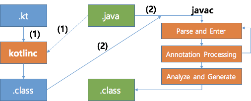

# Kotlin lombok

[[Reference] Kotlin 도입 과정에서 만난 문제와 해결 방법](https://d2.naver.com/helloworld/6685007)

Java 코드와 Kotlin 코드의 빌드 과정은 다음과 같은 순서로 이루어진다.

1. Kotlin 컴파일러가 Kotlin 코드를 컴파일해 .class 파일을 생성한다. 이 과정에서 Kotlin 코드가 참조하는 Java 코드가 함께 로딩되어 사용된다.
2. Java 컴파일러가 Java 코드를 컴파일해 .class 파일을 생성한다. 이때 이미 Kotlin이 컴파일한 .class 파일의 경로를 클래스 패스에 추가해 컴파일한다.

두 번째 과정은 다시 세 단계로 나눌 수 있는데, Lombok이 코드를 생성하는 단계는 세 단계 중 Annotation Processing 단계이다. 하지만 이 단계는 Kotlin 코드가 컴파일된 이후이기 때문에 Kotlin 코드는 Lombok이 생성한 코드를 사용할 수 없게 된다.

## 해결

1. Delombok
   - 롬복을 제거하고 POJO 코드로 변경

2. Kotlin으로 마이그레이션
   - [HeroKt](./HeroKt.kt)